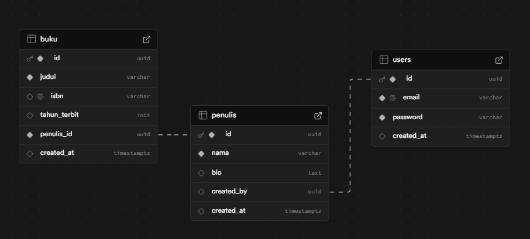

Alvin Ferina Putra

# Backend REST API Challenge - Perpustakaan

- a. Terdiri dari minimal 2 operasi crud yang saling berkaitan.
- b. Menyimpan data menggunakan database SQL
- c. Authentication api menggunakan JWT token.
- d. Buatkan fitur e2e testing untuk test token apinya.
- e. Pilih pattern project yang sering anda gunakan.
- f. Jelaskan mengapa menggunakan pattern tersebut di readme github.

- a) Saya membuat dua entitas yaitu Penulis dan Buku. Dimana satu penulis dapat memiliki banyak buku (one-to-many relationship).
- b) Saya menggunakan Supabase sebagai database SQL untuk menyimpan data Penulis dan Buku.
- c) Saya mengimplementasikan authentication menggunakan JWT token untuk mengamankan endpoint API.
- d) Saya telah menambahkan fitur e2e testing untuk menguji endpoint authentication API menggunakan Jest dan Supertest.
- e) Saya memilih pattern Layered Architecture untuk struktur project backend ini.
- f) Saya memilih Layered Architecture karena memisahkan tugas masing-masing dengan jelas antara controller, service, dan data access, sehingga memudahkan pengembangan, pengujian, dan pemeliharaan aplikasi.

# Perpustakaan API by @tsubametaa/Alvin

- Backend dengan NestJS, Supabase, JWT Auth, dan E2E Testing
- Web App dengan Astro, dan TailwindCSS

# Untuk mencobanya bisa melalui link berikut :

- View API :
- https://backend-rest-api-backend.vercel.app/

- View WebApp (untuk ujicoba manual):
- https://backend-rest-api-web.vercel.app/

- Untuk login bisa menggunakan akun berikut :
- Email: admin@uta.id
- Pass : Admin123

- Atau bisa daftar akun baru juga untuk uji cobanya.

- Untuk testing e2e bisa menjalankan perintah berikut di terminal :

```bash
cd apps/backend; npm run test:e2e
```

Table dalam database :

- buku
- penulis
- users



- Video Penjelasan Backend REST API : https://www.loom.com/share/1b23ab4e811f43b8a7f57b509e1e6672
- Video Penjelasan Frontend e2e Testing dengan cypress : https://www.loom.com/share/a22ca74a29644f17919ed53832d67bb6
